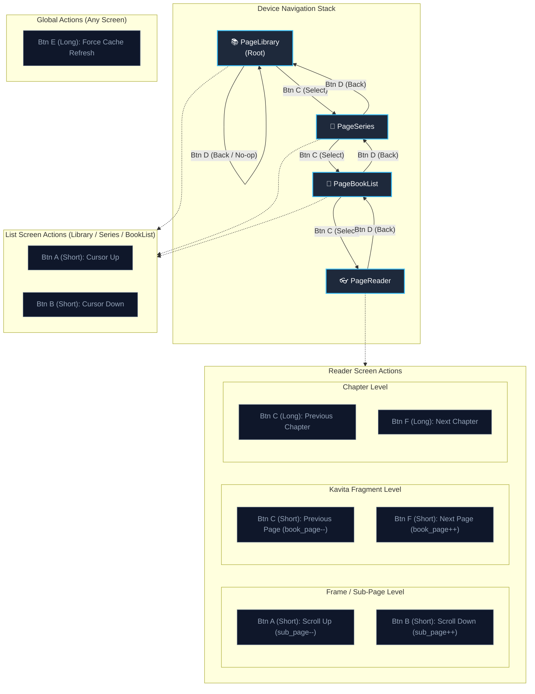

# 📖 Le Grimoire

Le Grimoire let's you read your fav books on custom made eink tablet. It has a headless rendering engine and media orchestration service built with Go, Kavita, and Chromedp.


## ✨ Features

* 🚀 **High Performance:** Lightweight and optimized for minimal resource usage.
* 🌐 **Flexible Browser Rendering:** Supports remote `headless-shell` sidecars, custom local Chrome paths, or automatic system discovery.
* 📚 **Kavita Integration:** Direct REST API connectivity with Kavita media servers.
* 🐳 **Container Ready:** Full Docker and Docker Compose workflows with persistent storage.
* 🛠️ **Cross-Platform Compilation:** Built-in targets for Linux, macOS (Intel & Apple Silicon), and Windows.

## 🛠️ Tech Stack

* **Language:** Go (1.27+)
* **Database:** SQLite
* **Media Server:** Kavita
* **Browser Automation:** Chromedp / Headless Shell
* **Containerization:** Docker / Docker Compose


## Prerequisites

Ensure you have the following installed:
* [Go](https://go.dev/doc/install) (version 1.27 or higher)
* [Docker](https://docs.docker.com/get-docker/) and [Docker Compose](https://docs.docker.com/compose/)
* [Git](https://git-scm.com/) version control system
* [Kavita](https://www.kavitareader.com/) server running and accessible. You can find more information about setting up Kavita [here](docs/setup-kavita.md).
* [golangci-lint](https://golangci-lint.run/) _(optional, for linting)_

## 🔑 Environment Variables

Create a `.env` file in the project root:

```sh
cp .env.example .env
```

| **Variable**        | **Description**                               | **Default**          | **Required** |
| ------------------- | --------------------------------------------- | -------------------- | ------------ |
| `MEDIA_DIR`         | Absolute path to your local media directory   | —                    | **Yes**      |
| `KAVITA_API_KEY`    | API authentication key for Kavita             | —                    | **Yes**      |
| `SERVER_HOST`       | Host IP address the server binds to           | `127.0.0.1`          | No           |
| `SERVER_PORT`       | HTTP port the server listens on               | `8080`               | No           |
| `KAVITA_BASE_URL`   | Base URL for the Kavita instance              | `http://kavita:5000` | No           |
| `CHROME_REMOTE_URL` | WebSocket/HTTP endpoint for remote Chromium   | `""`                 | No           |
| `CHROME_PATH`       | Direct path to a local Chrome/Chromium binary | `""`                 | No           |

> **Browser Selection Priority:**
>
> `CHROME_REMOTE_URL` > `CHROME_PATH` > Automatic local discovery fallback.
> 
> > Comment out `CHROME_REMOTE_URL` and `CHROME_PATH` if you want the application to automatically discover a local Chrome installation.


## 🏃 Getting Started

### 1. Running with Docker Compose (Recommended)

```sh
# Starts le-grimoire, kavita, and headless-shell
docker compose up -d --build

# View container logs
docker compose logs -f
```

### 2. Running Locally

1. Install dependencies:

    ```bash
    go mod download
    ```

2. Build and run the application:

    ```bash
    go build -o ./bin/le-grimoire main.go
    chmod +x ./bin/le-grimoire
    ./bin/le-grimoire
    ```

    or
    
    ```bash
    make build
    make run
    ```

## ⚙️ First-Time Device Setup

- **Hardware Credentials:** Each physical ESP32 has its unique `device_id` and secret `API Key` hardcoded in firmware, authenticated against the server's `devices` database table. For guide click [here](./docs/device-registration.md).

### Don't own a physical device yet?

You can still test the application using a virtual device. Open `test/client-simulator/index.html` in your browser and follow the instructions to simulate a device.

Make sure to [register](./docs/device-registration.md) a virtual device with the server first, and use the provided `device_id` and `API Key` in the simulator.

### 🎮 Hardware Controls & Button Mappings

The device features a 6-button physical layout (Left: **A, B, C** | Right: **D, E, F**). Global actions and context-specific controls are separated below.

#### 🌐 Global Controls (All Screens)

|**Button**|**Press Type**|**Action**|**Description**|
|---|---|---|---|
|**E**|**Long**|**Force Refresh**|Bypasses the render cache and forces a fresh render|
|**A / B / D**|Long|_No-op_|Unassigned / Reserved|

#### 📋 Menu & List Screens (`Library`, `Series`, `BookList`)

|**Button**|**Press Type**|**Action**|**Description**|
|---|---|---|---|
|**A**|Short|**Cursor Up**|Moves cursor up one item (`cursor--`)|
|**B**|Short|**Cursor Down**|Moves cursor down one item (`cursor++`)|
|**C**|Short|**Select / Enter**|Drills down into the next level (`Library` → `Series` → `BookList` → `Reader`)|
|**D**|Short|**Back**|Pops current page off the stack (safe no-op at `Library` root)|
|**E / F**|Short|_No-op_|Unassigned / Reserved|

#### 📖 Reader Screen

|**Button**|**Press Type**|**Action**|**Description**|
|---|---|---|---|
|**A**|Short|**Scroll Up**|Moves up one 24-line sub-page frame (`sub_page--`)|
|**B**|Short|**Scroll Down**|Moves down one 24-line sub-page frame (`sub_page++`)|
|**C**|Short|**Previous Page**|Decrements Kavita book page index (`book_page--`, resets `sub_page`)|
|**C**|**Long**|**Previous Chapter**|Switches to previous chapter in the series (resets pages)|
|**F**|Short|**Next Page**|Increments Kavita book page index (`book_page++`, resets `sub_page`)|
|**F**|**Long**|**Next Chapter**|Switches to next chapter in the series (resets pages)|
|**D**|Short|**Back**|Exits reader and returns to the `BookList` chapter overview|

### 🗺️ Navigation & Reading Flow

Navigation operates on a persistent per-device stack:




### 🏗️ Cross-Platform Builds

Compile static binaries for multiple operating systems directly to the `bin/` directory:

```sh
# Build for Linux (amd64)
make build-linux

# Build for Windows (.exe)
make build-windows

# Build for macOS (Intel & Apple Silicon)
make build-mac

# Build for all platforms simultaneously
make build-all
```


### 🧪 Quality & Linting

```sh
# Format code
make fmt

# Run Go vet analysis
make vet

# Run golangci-lint
make lint
```

### ⚠️ Error Handling & Troubleshooting

- **Boundary Safety:** The state machine strictly prevents navigating past chapter/page limits or scrolling above the top boundary.
- **Fallback Displays:** If Kavita or the headless browser crashes, the server delivers a standalone `"ERROR: CONTENT UNAVAILABLE"` bitmap to ensure the e-ink screen never freezes without diagnostic feedback.
- **Stale Content Clearing:** If a book or series is updated on Kavita, long-press **Button E** from any screen to invalidate the server render cache and regenerate fresh frames.


### 📄 License

This project is licensed under the MIT License. See the [LICENSE](LICENSE) file for details.
